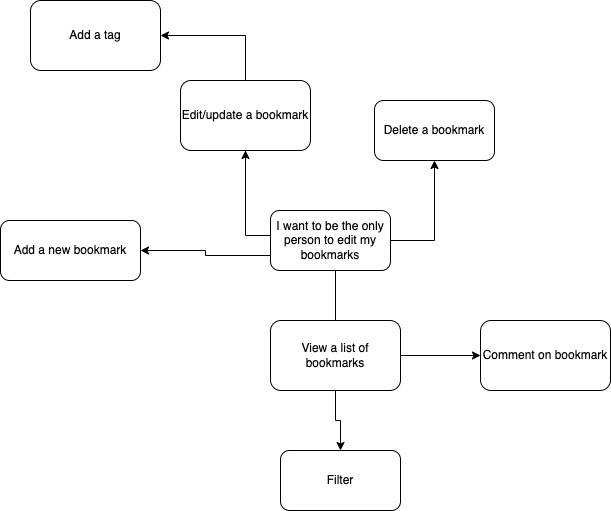

# bookmark-manager

This is the bookmark manager application. 

This application follows the challenge provided by Makers Academy via completing the user stories.

The user stories are created by myself based on the specifications given by Makers Academy.

Specifications:

-Show a list of bookmarks 

-Add new bookmarks

-Delete bookmarks

-Update bookmarks

-Comment on bookmarks

-Tag bookmarks into categories

-Filter bookmarks by tag

-Users are restricted to manage only their own bookmarks

The user stories are:

As a user,
I want to be able to view a list of bookmarks.
When I click on a button on the website, I want to see a list of bookmarks.

As a user,
I want to be able to add new bookmark to the list of bookmarks.
When I write down a bookmark name, I want it to remember my bookmark

As a user,
I want to be able delete a bookmark from the list of bookmarks.
I want to select the bookmark I don't want and delete it from the list.

As a user,
I want to update my bookmarks in the list of bookmarks.
I want to select the bookmark from the list and update it with new information.

As a user,
I want to be able to comment on the bookmark from the list of bookmarks.
I want to select the bookmark and add a comment to it. 

As a user,
I want to add a tag to a bookmark from the list of categories
I want to select a bookmark and add a tag to it from the list of categories.

As a user,
I want to filter bookmarks to see the relevant bookmarks.
I want to pick a tag so I can see the only bookmarks with that tag.

As a user,
I do not want others meddling with my list of bookmarks.
I want to be the only person to be able to edit my list of bookmarks.